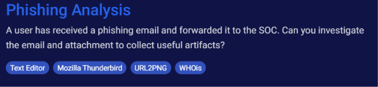
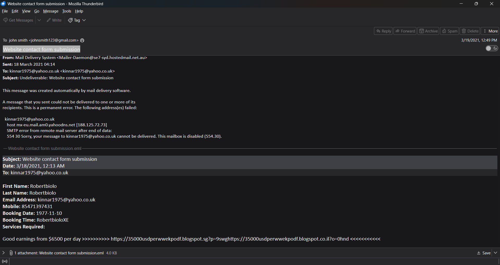
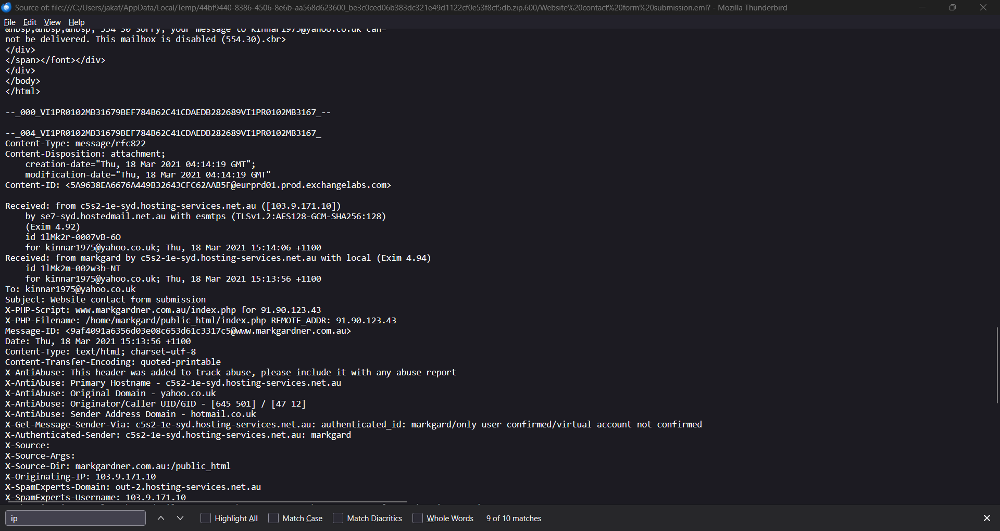
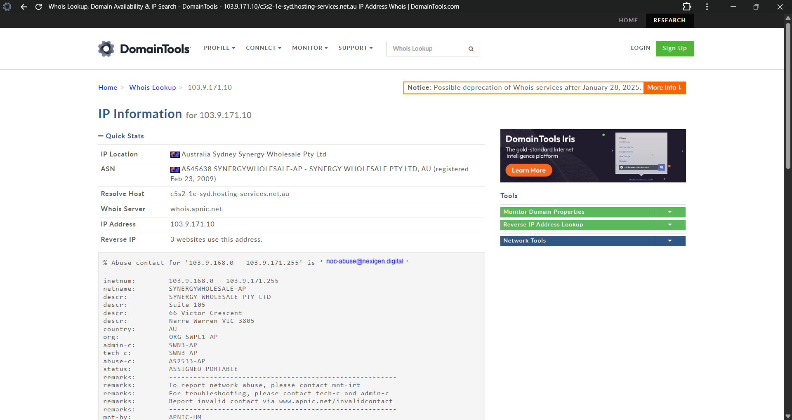
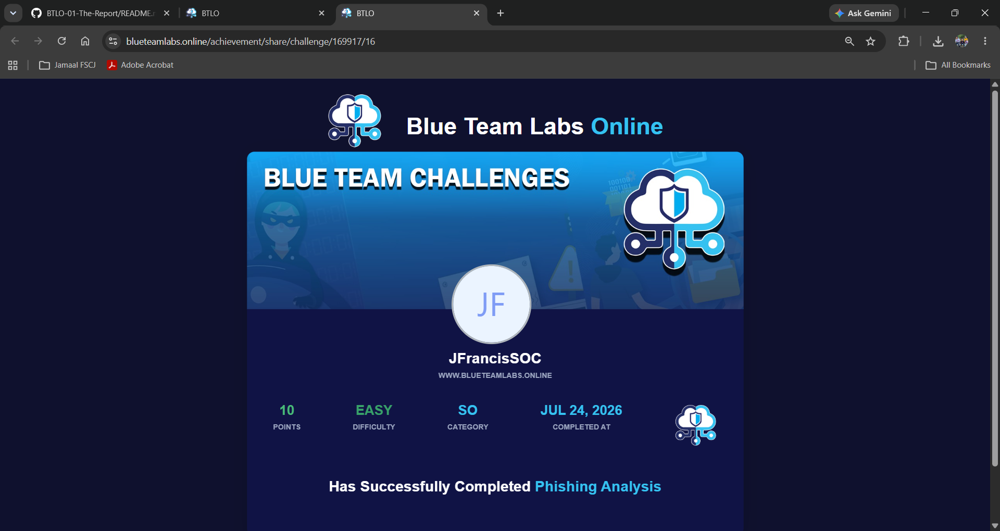

# 🛡️ BTLO-02: Phishing Analysis


## Overview

This repository contains my completed **Phishing Analysis** challenge from **Blue Team Labs Online (BTLO).**

In this challenge, I investigated a phishing email by reviewing the email, analyzing the headers, collecting indicators of compromise (IOCs), and researching the infrastructure used to deliver the message.

This lab gave me more hands-on experience investigating phishing emails while reinforcing the importance of verifying evidence before making investigative decisions.

> **Note:** This repository does **not** include challenge answers or walkthroughs. It focuses on the investigation process, the skills I practiced, and what I learned throughout the challenge.

---

# Challenge Information

| Field | Information |
|:------|:------------|
| Platform | Blue Team Labs Online |
| Challenge | Phishing Analysis |
| Category | Phishing |
| Difficulty | Easy |
| Points Earned | 10 |
| Status | ✅ Completed |

---

# Skills I Practiced

- Email Analysis
- Email Header Analysis
- IOC Collection
- Reverse DNS Lookups
- WHOIS Research
- URL Investigation
- Threat Intelligence
- Phishing Detection
- Evidence Verification
- Security Documentation

---

# Topics Covered

- Phishing Emails
- Email Headers
- Message-ID
- Originating IP Addresses
- Reverse DNS
- WHOIS
- Indicators of Compromise (IOCs)
- URL Analysis
- Blogspot Infrastructure
- Threat Intelligence

---

# Investigation Workflow

1. Reviewed the phishing email.
2. Identified the sender, recipient, subject, and timestamp.
3. Examined the email headers.
4. Identified the originating IP address.
5. Performed a reverse DNS lookup.
6. Investigated the embedded URL.
7. Collected indicators of compromise (IOCs).
8. Determined the phishing objective.
9. Documented the investigation.

---

# Tools Used

- Mozilla Thunderbird
- Notepad++
- WHOIS
- URL2PNG
- Blue Team Labs Online

---

# Challenge Walkthrough

## Step 1 - Challenge Overview

I reviewed the challenge description to understand the investigation objective before beginning the analysis.



---

## Step 2 - Reviewing the Email

I opened the email in Thunderbird and reviewed the sender, recipient, subject, body, and attachment before beginning the investigation.



---

## Step 3 - Analyzing the Email Headers

I examined the raw email headers to identify the originating IP address, message routing, and other metadata used during the investigation.



---

## Step 4 - Investigating the Infrastructure

I performed reverse DNS and WHOIS lookups to gather additional information about the infrastructure used to deliver the phishing email.



---

## Step 5 - Challenge Completed

After completing the investigation and validating my findings, I successfully completed the BTLO challenge.



---

# Key Takeaways

This challenge gave me more hands-on experience investigating phishing emails from start to finish.

I learned how to:

- Read email headers.
- Trace an email back to its originating IP address.
- Perform reverse DNS lookups.
- Investigate suspicious domains and URLs.
- Collect indicators of compromise (IOCs).
- Follow the evidence before making investigative decisions.

---

# Investigation Summary

During this investigation, I identified multiple indicators commonly associated with phishing activity, including suspicious URLs, abnormal contact form data, and infrastructure used to deliver spam through a website contact form.

This challenge reinforced the importance of validating email metadata, researching suspicious infrastructure, and documenting findings before reaching a conclusion.

---

# Repository Structure

```text
BTLO-02-Phishing-Analysis
│
├── README.md
├── 01-BTLO-Phishing-Analysis-Challenge-Overview.png
├── 02-BTLO-Phishing-Analysis-Email-View.png
├── 03-BTLO-Phishing-Analysis-Raw-Headers.png
├── 04-BTLO-Phishing-Analysis-Domain-Investigation.png
└── 05-BTLO-Phishing-Analysis-Challenge-Completed.png
```

---

# Continuous Learning

I am continuing to build hands-on cybersecurity experience through:

- Blue Team Labs Online
- SOC Investigation Case Files
- Microsoft Sentinel
- Splunk
- Wireshark
- KQL
- MITRE ATT&CK

Every investigation helps me improve my analytical thinking, documentation skills, and understanding of real-world SOC workflows.

---

# Connect With Me

## LinkedIn

https://www.linkedin.com/in/jfrancissoc/
